<h3><code>dias@github ~ $ whoami</code></h3>

<table>
<tr>
<td valign="top"></td>
<td valign="top"></td>
</tr>
</table>

 
 

<h3><code>dias@github ~ $ ./links.sh</code></h3>

<b>Full-stack Developer · Product Builder · Studio Founder</b>

 

Astana, Kazakhstan · Open to remote roles worldwide

---

## Track record

- **4+ years** shipping production web and mobile products
- **600k users** on Aleem, an Alchemist-backed AI learning platform
- **65+ launches** through [Dala Digital](https://dala.framer.website)
- Products delivered for national platforms, a **Top-5 Russian insurer**, and a major US construction company
- Based in Astana, Kazakhstan and open to remote roles worldwide

## Selected work

| Project | What I shipped | Stack |
|---|---|---|
| **SmartCity** | National dashboard for camera-based road-violation enforcement | Django · DRF · PostgreSQL · AWS |
| **Aleem** | AI English-learning super-app serving 600k users; backed by Alchemist Accelerator | Django · React Native |
| **VSK Insurance** | Online sports-accident insurance for a Top-5 Russian insurer with 33M+ clients | Django · Nuxt.js |
| **Construction Parser** | Extracts and visualizes soil data from geotechnical PDFs for a major US construction company | Python · Django |
| **Whale** | MedTech app for medication, mood, and doctor-sharing workflows | React Native |
| **Hangout** | Social backend for city events, lobbies, comments, and real-time interaction | Django · DRF · Celery |
| **Finance.kz** | National finance portal that achieved 62% monthly traffic growth | Vue.js · Nuxt · Laravel |
| **Plano AI** | AI college-admissions platform for international students | Django · Next.js |

## Stack

- **Backend:** Python · Django · DRF · Celery · FastAPI · Node.js · Laravel
- **Frontend:** React · Next.js · Vue.js · Nuxt
- **Mobile:** React Native · Expo
- **Cloud:** AWS · Azure · Docker · CI/CD
- **Data:** PostgreSQL · Redis

## About

I’m a full-stack developer and founder of [Dala Digital](https://dala.framer.website). I build production products end to end, from backend architecture and APIs to mobile and web interfaces. I care about shipping quickly, owning outcomes, and turning complex workflows into software people can actually use.
